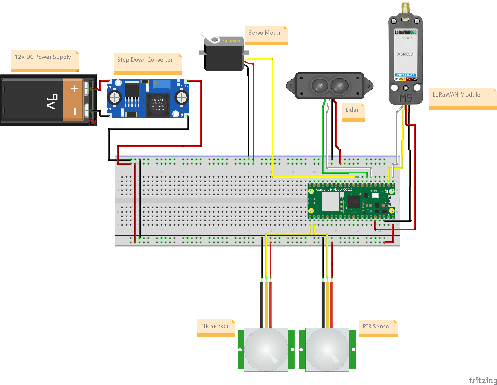
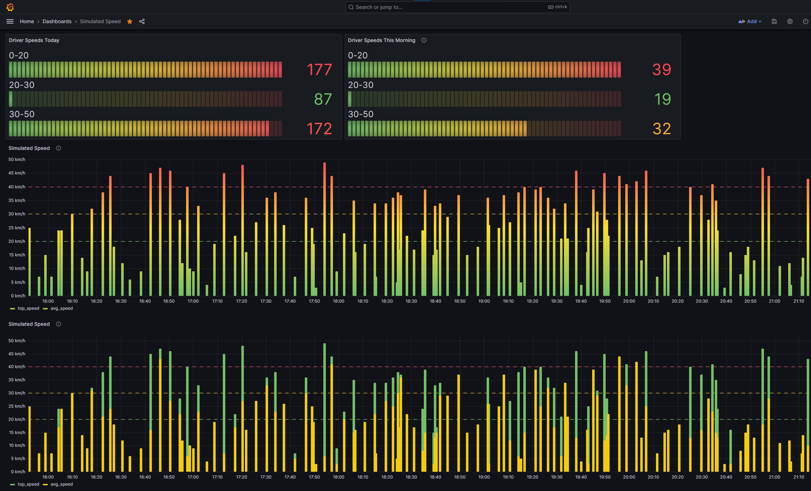

IoT Speed Trap

Node for Speed: LoRacer
-----------------------

Made by: Carl Johan Grevby (cg223aj)

Authors note: This guide is meant to inform readers of what they need to build the IoT Speed Trap. For a more in-depth and less "template bound" write-up of the work process in this project I refer the interested reader to my HackMD: https://hackmd.io/@DorvoG/iot-speedtrap

Introduction
============

Until cars reach full autonomy, people speeding will remain a problem. There are several ways to mitigate this and a collective term for these methods is "traffic calming." In cities they make roads narrower, install speedbumps, build roundabouts and set up adaptive speed signs. Out in the country side, methods are often less sophisticated but they don't have to be.

In this study I propose a method using IoT to create a low power device that can give drivers visual feedback on their driving while also logging the events for further analysis.

Using LIDAR to measure the speed of oncoming vehicles, a servo arm to visually indicate the drivers speed and transmitting the data over LoRaWAN to a server.

Time to build
=============

I have spent countless hours going down countless rabbit holes while researching this project. I approximate that I have spent around 40-50 hrs/week during 5 weeks. They say time enjoyed is never wasted and am inclined to agree.

I put in the work so that you don't have to. If you follow this guide the estimated time to complete it is as follows:

- Research and parts acquisition -- 2 to 5 hours

- 3D-printing components -- 2 to 3 hours (not including print time)

- Speed trap assembly -- 2 to 5 hours

- Speed trap configuration and calibration -- 2 to 3 hours

- Server installation and configuration -- 2 to 3 hours

- Installation and commissioning -- 1 to 2 hours

Your mileage may vary depending on your previous knowledge and equipment at home, but between 11 and 21 hours does seem reasonable. Much more reasonable than the 200 -- 250 hours I've spent, don't you think?

Why I chose this project
========================

My parents live in the countryside on a farm and the recommended speed on the road going through the farm is 20 km/h. Not everyone adheres to these recommendations and animals or people might get hurt because of it.

I chose this project as I saw an opportunity to solve a real-world problem, to help drivers reduce their speed! All while learning as much as I can about IoT and the world surrounding it. I'd get to research hardware and software and how they interface with each other and the physical world. Fun!

What purpose does it serve
==========================

This project serves as a way of implementing a digitized form of traffic calming, helping drivers reduce their speed. It also processes and stores data for further analysis.

What insights will it give
==========================

With the data gathered one can start drawing conclusions. When are people speeding? In the morning while late for work? At night when they think no ones watching? What direction has the highest average speed? How many cars pass in a day? What percentage of those cars are speeding?

These are just some of the answers we can get from analyzing the data, which in turn can help us further understand how to "calm the traffic."

Bill of materials
=================

For an exact BoM with individual prices of components and links to places of purchase, please see "Bill of Material.xlsx" in the GitHub root folder.

I have grouped the components by "Necessary components" and "Optional components." Under Necessary components you'll find what you need to create the bare bones version of this project. An MCU (Pi Pico WH), LoRa Module (M5Stick), Lidar (Benewake TF Mini S), PIR Sensors (HC-SR501), Servo Motor, DC-DC step down converter etc. With these components you can connect everything to a breadboard and run the code.

Under optional components you'll find components that I've used in this project that provide additional or different functionality.

For example:

- The polycarbonate box from Elfa and 3D-printing filament to make an enclosure

- LiPo-battery, LiPo-charger, XT60 connector and fuse to power the device "off grid"

- CDM324 microwave doppler sensor and amplifier (backpack) to measure distances

- Ultrasonic Distance sensor to measure distances

- Assorted screws, cabling, solder, heat shrink tubing etc. for assembly

Programming the Pico
====================

For this project I ended up using Thonny 4.1.1 (<https://thonny.org/>), an open source IDE developed by the University of Tartu. Easy to use and easy to understand, no additional software needed.

When you set up your Pi Pico, you initially need to load the MicroPython firmware onto the device. Download the latest firmware from the MicroPython website (<https://micropython.org/download/rp2-pico-w/>). At time of writing it is "v1.20.0 (2023-04-26) .uf2".

Hold down the bootselect button on the Pico and connect it to your computer via USB. It will show up as a removable drive. Copy the firmware file (.uf2) onto the Pico and it will reboot itself and apply the new firmware.

When it restarts it shows up as "Board in FS mode" and you are ready to interact with it via Thonny. Just select the correct COM-port in the bottom right corner which, unless you have several different Picos connected, will be the only one in the list.

In the left sidebar you can navigate to where you have saved the relevant code-files. Now you can just drag and drop files onto the Pico that is also displayed in the left sidebar.

To run the Pico in standalone mode, at the very least you need to have a main.py file in the root directory of your Pico. To run this project, copy the files from the "Python Code" directory onto your Pico.

Electrical connections and calculations
=======================================

12V LiPo or Power Supply delivers power to the step down converter that converts the voltage down to 5.1V. The Pi Pico and all the modules run off of the 5V bus, and they communicate over 3.3V TTL. The current setup is a work in progress and further development is needed.

Calculations
------------

The power consumption of the speed trap was measured under two operating conditions. The first condition, referred to as the 'rest state', had an energy consumption of 85 milliamperes at 12 volts. This corresponds to a power consumption of approximately 1.02 Watts, a calculation derived from the standard formula P=IV, where P is the power, I is the current, and V is the voltage.

Under the second condition, the measurement state, when the servo motor was running at "full tilt," the power consumption was greater, reaching up to 300 milliamperes at 12 volts, approximately 3.6 Watts.

A 2.65Ah, 3-series (11.1V) Lithium Polymer (LiPo) battery is used to power the speed trap. In the 'rest state', it is calculated to be able to operate for approximately 26 hours. Meanwhile, in the measurement state, the runtime is reduced to approximately 7.36 hours.

These durations were calculated based on the battery's capacity (2.65Ah) and the speed trap's current consumption (85mA at rest and 300mA at peak). The formula used for this calculation is T = C/I, where T is the time, C is the battery capacity, and I is the current.

An average runtime of approximately 24 hours per charge was estimated for the speed trap. With a runtime of a full day, the speed trap could be powered by a solar panel during the day and recharge the batteries for night time operation.

The Platform
============

To store and visualize the data collected, I set up a containerized stack that consists of Node-RED, TimescaleDB and Grafana, all running under Docker. Docker in turn is installed on top of a Raspberry Pi 3B running Raspbian OS.

I have uploaded my docker compose file to the GitHub to allow you to run the same or a similar stack solution.

Self hosting a server was chosen to allow for greater control of the data, software and hardware.

I chose Docker because it allows for isolation, scalability and portability. Should the need to upscale the stack, the hardware can be upgraded to a Pi4 8GB and if that isn't enough, it can be run on proper server hardware. Should you desire to scale even further I recommend you to look into Kubernetes, but make sure you're fed and well rested first.

Node-RED was chosen as the data handling agent for its ease of use and visual interface. It was set up and configured so that it subscribes to TTN via MQTT, extracts the relevant data and injects it into TimescaleDB. It also allowed for easy debugging during the setup process.

TimescaleDB is a postgresql database with an emphasis on timestamping the data. This fits well with the project as all the data being logged is tied to the time they occurred. Timescale also allows for scaling up should the need arise in the future.

Grafana was chosen as the data visualization tool. It's easy to use, lightweight and powerful. It can visualize data from many sources, a feature I found useful when for example debugging. It has the potential to scale together with the rest of the system. You can set triggers based on certain thresholds. I never had time to implement this but one could for example set up push notifications when a "speeding event" is recorded.

The Code
========

All of the relevant code in this project has been uploaded to GitHub and resides under their respective directories.

Connectivity
============

Data is transmitted after every event (e.g. a passing car) over LoRaWAN to The Things Network. There it is forwarded via MQTT to servers subscribing to the relevant topics.

LoRaWAN was chosen for it's low power consumption and greater range compared to WiFi. This allows the speed trap more flexibility in where it is placed and how to power it.

To increase security, one should implement hashing of the data being transmitted. There is also potential to both reduce payload size for example using 8 bit integers instead of 16. And increasing the information passed in those bytes for example using signed integers and the leftmost bit represents the direction the car was headed. I doubt speeds over 127 km/h are needed anyway, at least not here.

Presenting the data
===================

Data is saved in the database every time an event is triggered at the speed trap. It is presented to the user in Grafana. For more information regarding choice of database, visualization and triggers see the "Platform part" of the Readme.

Final thoughts
==============

This project went well and I am happy with the results. I have learned so much in so many different areas of IoT that I don't know how exactly I managed to cram everything in such a short period of time.

But the artist who says that they are satisfied with their work is a liar. There is so much more I would like to have tried, tinkered, coded, hacked, built and upgraded.

To name a few things:

- Being able to change and push the Pico config remotely

- Implementing machine learning

- Get the Doppler Radar to work

- Try out the ultrasonic sensor

- Implement a hashing algorithm for the transmitted data

- Implement more efficient computation of the logged speed data (on the pico)

- Implement a buffered send function, if the message doesn't transmit properly

- A large numerical display showing the measured speed to drivers

- "PID tuning" on the speed data so that the cat tail moves more smoothly

- Implement Sleep functionality to save on power

- Implement a relay to be able to turn off power to unused components.

- Make a video (I even wrote a script for it, but time makes a fool of us all)

- Implement a charging circuit for the batteries

- Solar power

- Recording the direction of the cars that pass

- Etc.

Being ever the temporal optimist, on deadline day I designed a miniaturized version of the speed trap that retains all the basic functionality and includes battery power. The cat got a little brother so to say.

As I previously stated, I am very happy with how the project progressed. If you're interested and would like to know more, don't hesitate to contact me.

Pictures!
=========
